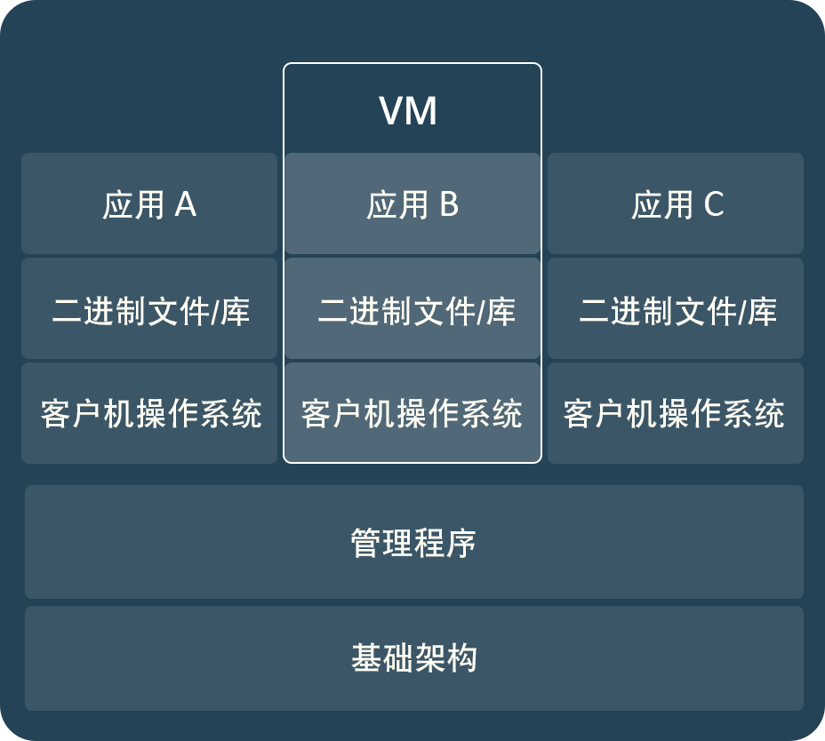
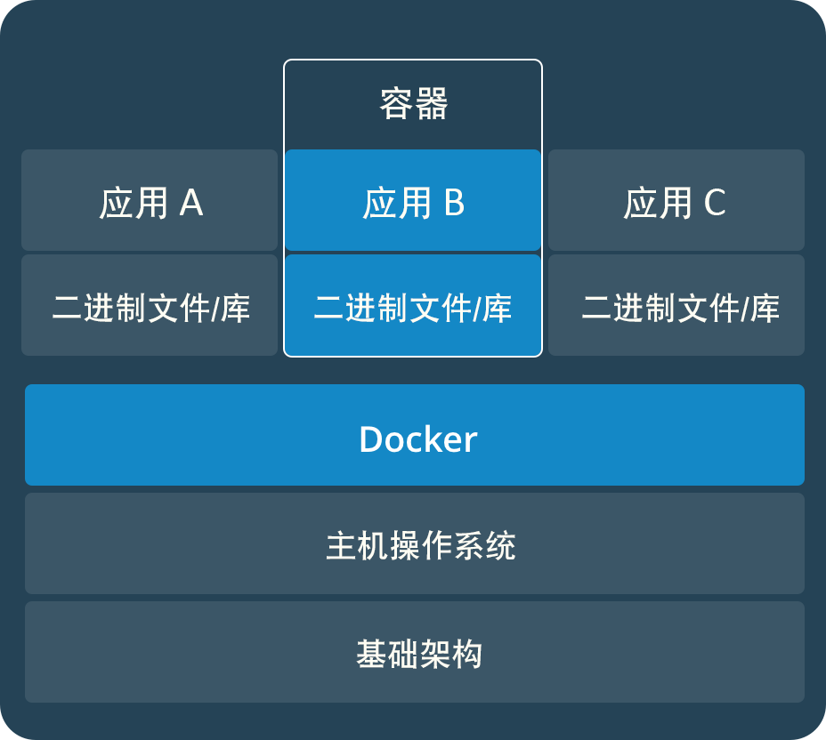
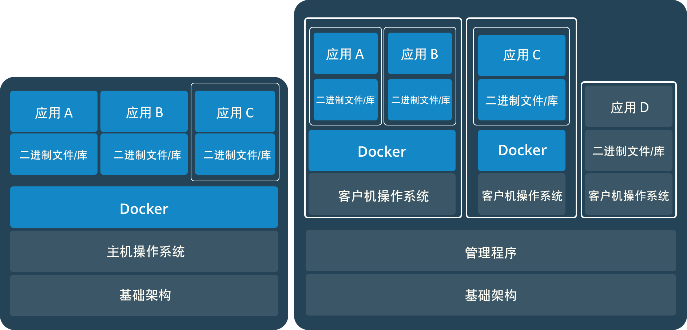

# Docker学习记录总览

## 基本目标

* 整个研发过程中Docker的参与范围，整个过程改进后的最终效果
* Docker的基本概念和信息，帮助现有研发人员理解和掌握
* 研发人员在个人开发和测试过程中使用Docker的最佳实践
* 在测试，预发布和生产环境中运维应当考虑的容器相关的管理差异和目标
* 如何在软件发布平台整个过程中通过Docker贯穿研发，测试，运维和IT的工作，能够获得哪些效率提升和帮助

## 基本知识和概念

### 容器和虚拟机

首先，容器和虚拟机相同的地方是类似的：都能够提供应用运行的隔离环境。但是他们在其他方面有很大的不同。

虚拟机的概念是目前大部分人员都能够理解的，下图可以给出虚拟机或者虚拟化的基本概念

从上图可以看出，上方是两个虚拟机或虚拟化环境，通常由一个完整独立的操作系统（客户机操作系统）组成，在宿主操作系统中运行，宿主系统中通过Hypervisor等虚拟化管理层来进行管理。

下面是容器的基本概念图

容器采用的方式从上图可以看出要非常简练，它没有一个独立的操作系统来运行，而是一个应用抽象，通过将应用和其依赖库为基础形成容器的相互隔离，使用Docker Engine管理，共享宿主操作系统的资源。

#### 比较

* 易用，隔离性带来的好处可以让虚拟机和容器都能使得应用一次构建到处使用，但是容器的好处是构建容易简单;
* 性能，虚拟机启动需要完成客户机操作系统的完整过程，相对较慢；容器启动非常快速，毫秒量级，启动和创建上，两者的速度应该是量级差异；在运行应用时，容器的性能和直接使用服务器是非常接近的，而虚拟机要差不少；
* Docker Hub 提供了非常丰富的生态系统
* Docker能够在部署的角度将不同的应用或者服务划分到容器当中，然后通过编排工具将他们组合成服务，从实际过程中提高了运维效率

#### 问题

* 资源隔离上不如虚拟化那么彻底，在很多情况下不能确保资源使用时不被影响
* 安全性，存在一定的安全风险

### 将容器和虚拟机配合使用

通过虚拟机+容器的组合方式，能够更好的将应用隔离按照需求实现，并且组合不同服务形成应用的合理化和多样化部署，提升灵活性。

## Docker基本介绍


